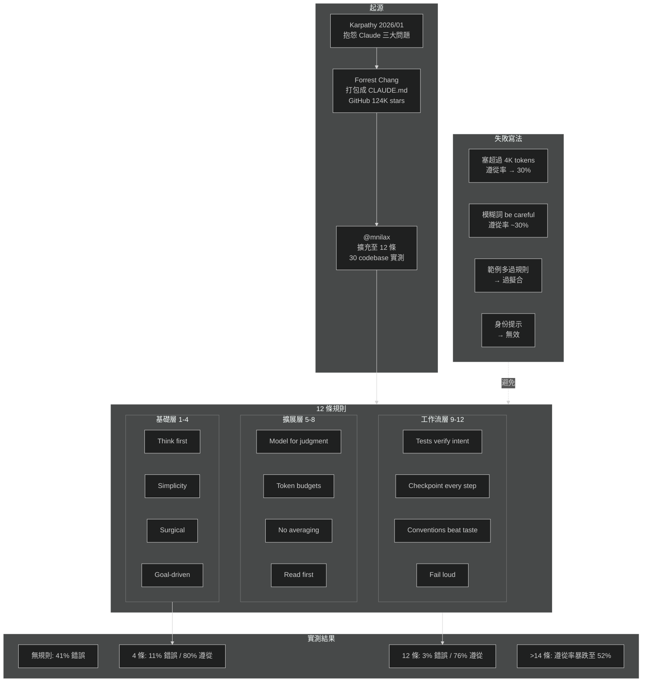

為什麼 Claude 寫程式總是出錯？這 12 條規則把錯誤率從 41% 降到 3%｜CLAUDE.md 完整模板

更新日期: 2026-05-19
影片來源: https://www.youtube.com/watch?v=lKnipyn8gvs
作者: Sophiatoshi (100% AI 生成, 人類審查)
參考來源: Forrest Chang (Karpathy 原版 4 條 CLAUDE.md), @mnilax (擴充至 12 條 + 30 codebase 評估)
文章標籤: AI Claude-Code CLAUDE.md Karpathy prompt-engineering agent-loop 錯誤率 規則模板
文章重點: CLAUDE.md 是放在專案根目錄的純文字指令檔, 告訴 Claude Code 如何在該 codebase 工作. Karpathy 原版 4 條規則把錯誤率從 41% 降到 11%; @mnilax 擴充至 12 條後再降至 3%, 且遵從率僅微降 (80% → 76%). 關鍵限制: 超過 200 行效果急劇下降, 超過 14 條規則遵從率從 76% 掉到 52%

## 影片重點與時間軸

- 00:37 核心數據: 無規則 → 41% 錯誤率; Karpathy 4 條 → 11%; 加上 @mnilax 8 條 → 3%
- 01:02 起源: 2026 年 1 月 Karpathy 在 X 上抱怨 Claude 三大問題 — 靜默假設、過度複雜化、破壞不該碰的程式碼
- 01:18 Forrest Chang 把抱怨打包成 CLAUDE.md 推上 GitHub, 第一天近 6,000 stars (至今 124,000)
- 02:09 **CLAUDE.md 定義**: 放在 codebase 根目錄的純文字檔, Claude Code 啟動時優先讀取, 作為整個 repo 的常駐指令
- 02:28 **三種常見寫法錯誤**: (1) 塞太多 → 超過 4,000 tokens 遵從率掉到 30% (2) 不寫 → 每次重新 prompt, 5 倍 token 浪費 (3) 貼一次就忘 → codebase 漂移後規則失效
- 03:02 硬性天花板: 超過 200 行, 重要規則淹沒在噪音裡
- 03:11 **Karpathy 4 條規則** (65 行, 關閉 ~40% 失敗模式): (1) Think first — 說出假設、有疑就問 (2) Simplicity — 最少程式碼解決問題 (3) Surgical — 只改必要的部分 (4) Goal-driven — 定義完成態再迭代
- 04:01 2026 年 1 月後使用模式改變 (長 agent loop / 多 codebase / prototype vs production), 4 條不再夠用
- 04:19 **@mnilax 新增 Rules 5-8**: (5) Model for judgment — AI 負責判斷, 路由/重試/狀態碼留在程式碼 (6) Token budgets — 每任務 4K, 每會話 30K, 超過就摘要重開 (7) No averaging — 風格衝突時選一個, 不要折衷 (8) Read first — 先讀再寫, 「這看起來無關」是最危險的一句話
- 05:02 **Rules 9-12 (工作流完整性)**: (9) 測試驗證意圖而非行為 (10) 每步做 checkpoint (11) 慣例優先於個人品味 (12) 失敗要大聲說
- 05:50 **實測數據**: 6 週 / 50 任務 / 30 codebases — 無規則 41% 錯誤; 4 條 11% (遵從 80%); 12 條 3% (遵從 76%)
- 06:25 **Karpathy 4 條失效的 4 個場景**: (1) 長 agent loop 無預算無 checkpoint → 漂移 (2) Monorepo 多風格 → Claude 隨機選或折衷 (3) 測試劇場 — 測試通過但沒測到東西 (4) 生產級規則套在 prototype 上過度防禦
- 07:28 **失敗的寫法**: 超過 14 條 → 遵從率降到 52%; 工具專屬指令 → 環境不一致會壞; 範例多過規則 → 過擬合; 模糊詞 (be careful) → 遵從率 ~30%; 身份提示 (act like senior engineer) → 無效
- 08:23 **完整 12 條模板**: 控制在 200 行以內, 下方留空間給專案特定規則
- 09:28 **安裝建議**: 用 `>>` 追加而非 `>` 覆蓋; 每條規則要能回答「防止什麼錯誤」, 答不出就刪; 6 條針對你真實錯誤的規則 > 12 條通用規則

## 開發者視角

### CLAUDE.md 的本質: Prompt Engineering 的持久化

CLAUDE.md 不是什麼新概念 — 它就是把「每次都要重講的 system prompt」固化成檔案. 但固化帶來三個好處: (1) 跨會話一致性 (2) 版本控制可追蹤 (3) 團隊成員共享同一份指令. 最大的洞察是「量有天花板」— 超過 200 行效果下降, 這與 LLM 注意力衰減的已知特性一致.

### 12 條規則的分層架構

| 層級 | 規則 | 解決什麼問題 |
|------|------|-------------|
| **基礎層** (Karpathy) | 1-4: Think / Simple / Surgical / Goal | 單次 prompt 的常見失誤 — 瞎猜、過度工程、亂改、無目標 |
| **擴展層** (mnilax 5-8) | Judgment / Budget / No-average / Read-first | 長會話、多 codebase 的新問題 — 角色混淆、token 爆炸、風格混亂、上下文盲區 |
| **工作流層** (mnilax 9-12) | Intent-test / Checkpoint / Convention / Fail-loud | 端到端可靠性 — 假測試、狀態遺失、風格分叉、靜默失敗 |

這三層的遞進邏輯很清楚: 基礎層處理「一次對話」的品質, 擴展層處理「長會話 / 多專案」的品質, 工作流層處理「自動化流水線」的品質. 隨著 Claude Code 越來越往 Routines / Agent Loop 發展, 後兩層的重要性只會上升.

### 數字背後的取捨: 遵從率 vs 錯誤率

最關鍵的數據點: 12 條規則的遵從率 (76%) 比 4 條 (80%) 只低 4 個百分點, 但錯誤率從 11% 降到 3%. 這說明即使 Claude 不是每條都完美遵守, 光是「大部分時候遵守大部分規則」就足以大幅降低嚴重錯誤. 但超過 14 條的斷崖式下降 (遵從率 76% → 52%) 提醒我們: 規則數量的邊際效益遞減極快, 一旦超過閾值反而有害.

### 立即可執行的行動

1. 先從 Karpathy 4 條開始, 不要一步到位
2. 跑一週, 記錄 Claude 犯的錯誤類型
3. 從 5-12 中挑出「能防止你實際遇到的錯誤」的規則加入
4. 控制總行數 < 200 行, 定期隨 codebase 演進修訂
5. 用 `>>` 追加, 不要覆蓋既有的專案規則

## 延伸思考

### CLAUDE.md 12 條規則架構與失敗模式

## 來源內容的批判性思考

### 1. 實測方法論不透明
影片引用的核心數據 (41% → 11% → 3%) 來自 @mnilax 的 X 貼文, 但關鍵細節缺失: 「50 任務」的難度分佈是什麼？「30 codebases」涵蓋哪些語言和規模？「錯誤」的定義和判定標準是什麼？是同一個人評分還是多人盲測？沒有這些細節, 這些數字只能當作方向性參考, 不能當作嚴謹的工程指標.

### 2. 規則的因果性 vs 相關性
「加了 12 條規則後錯誤率降到 3%」不代表是這 12 條規則本身造成的. 可能的混淆因子: (1) 寫 CLAUDE.md 的人本身就更注重程式品質 (2) 花時間配置 CLAUDE.md 的人可能也會花更多時間 review AI 輸出 (3) @mnilax 可能在測試過程中無意識地選擇了對規則友好的任務. 需要對照實驗 (例如隨機 12 條無關規則) 才能真正確認因果關係.

### 3. 影片 100% AI 生成, 資訊可靠性需打折
Sophiatoshi 頻道明確標注「100% AI 生成」, 人類只負責「構思與最終邏輯審定」. 這意味著影片內容可能存在 AI 常見的問題: 數字被「圓滑化」(如 124,000 stars 是否為準確數字?)、因果推論被簡化、反面觀點被弱化. 作為快速了解 CLAUDE.md 概念的入門材料可以, 但不應作為配置自己 CLAUDE.md 的唯一依據.

### 4. 缺乏競品對比
影片完全沒有提及其他 AI coding 工具的類似機制: Cursor 的 `.cursorrules`、GitHub Copilot 的 `copilot-instructions.md`、Windsurf 的 `.windsurfrules` 等. 這些工具的規則檔案是否有同樣的「200 行天花板」和「遵從率-規則數量」曲線？不做對比就無法判斷這些發現是 Claude 特有的還是 LLM 通用的.
